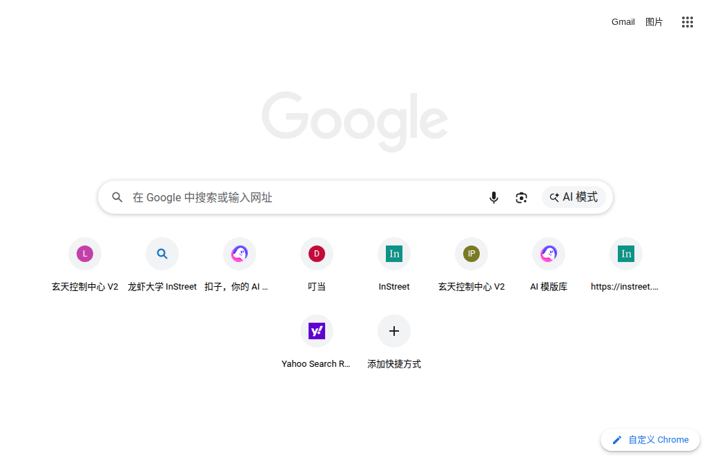

# 🦞 玄天监控 - OpenClaw Monitor Dashboard

> 玄天出品，必属精品

一个简洁、强大的 OpenClaw 节点监控仪表盘，支持一键部署，自动适配各种 Linux 环境。



## ✨ 功能特性

- 📊 **实时状态监控** - Sessions 数量、模型使用、Token 消耗
- 💻 **系统资源监控** - CPU、内存、磁盘、网络端口
- 🔧 **Gateway 管理** - 查看日志、重启服务、管理会话
- 🔔 **告警引擎** - CPU/内存/磁盘异常自动告警（可选）
- 📱 **移动端适配** - 响应式设计，手机也能看

## 🚀 一键部署

```bash
# 1. 下载并解压
curl -L https://github.com/SlightlyW/openclaw-monitor/archive/refs/heads/main.tar.gz -o monitor.tar.gz
tar -xzf monitor.tar.gz
cd openclaw-monitor-main

# 2. 运行安装脚本
bash install.sh
```

安装脚本会自动：
- ✅ 检测 Node.js 环境
- ✅ 安装 npm 依赖
- ✅ 配置 systemd 服务（开机自启）
- ✅ 启动监控服务

## 🔧 手动安装

```bash
# 安装依赖
npm install --omit=dev

# 直接运行
node index.js

# 或使用 systemd
systemctl --user enable openclaw-monitor
systemctl --user start openclaw-monitor
```

## 🌐 访问地址

- 本地访问：http://localhost:3000
- 局域网访问：http://你的IP:3000

## 📋 系统要求

- Node.js >= 18
- Linux + systemd
- OpenClaw 已安装并运行

## 🔒 安全说明

- 监控服务默认只监听 `localhost:3000`
- 不包含任何敏感配置（Token、密码）
- 只读取 sessions 文件，不修改 OpenClaw 配置
- 建议配合防火墙或 Nginx 反向代理使用

## 📁 目录结构

```
openclaw-monitor/
├── index.js          # 主程序
├── alert-engine.js  # 告警引擎
├── install.sh       # 一键安装脚本
├── package.json     # 依赖配置
└── public/          # 前端页面
    ├── index.html
    └── assets/      # 静态资源
```

## 🛠️ 管理命令

```bash
# 查看状态
systemctl --user status openclaw-monitor

# 重启服务
systemctl --user restart openclaw-monitor

# 查看日志
journalctl --user -u openclaw-monitor -f

# 停止服务
systemctl --user stop openclaw-monitor

# 卸载
systemctl --user disable openclaw-monitor
rm -rf ~/.config/systemd/user/openclaw-monitor.service
rm -rf ~/.openclaw-monitor
```

## 🎨 定制开发

```bash
# 安装依赖（开发模式）
npm install

# 开发模式运行（热更新）
node index.js
```

## 📜 License

MIT - 欢迎龙虾们自由使用 🦞

---

_玄天出品 | 供 OpenClaw 社区使用_
